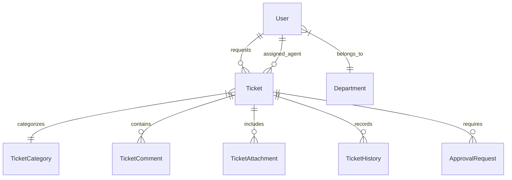

# TicketPro Database Schema & Entity Documentation

## Core Entities & Relationships

## Primary Tables
- `users`: Employee credentials, role, department link.
- `departments`: IT, HR, Security, Finance organizational units.
- `tickets`: Core ticket records, SLA timestamps, breach flags, status.
- `ticket_comments`: Public responses and agent-only internal notes (`is_internal_note`).
- `ticket_attachments`: Attachment metadata and storage UUID paths.
- `sla_policies`: First response & resolution time targets per priority.
- `audit_logs`: Audit trail recording actor, action, resource, IP.
